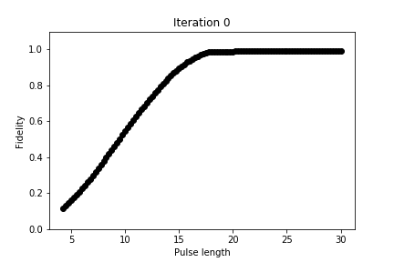
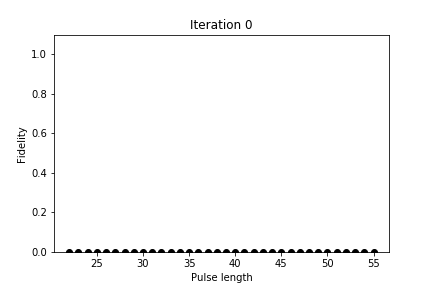

# Encoding of Qubit States in Resonators With Cat Codes
Source code and data for the Master's thesis Encoding of Qubit States in Resonators With Cat Codes.
The source code and PDF of the report is available at [cat-code-masters-thesis](https://github.com/JohanWinther/cat-code-masters-thesis).

This repository contains a lot of "unnecessary" code which have been moved to the [Archive](Archive) folder, but the most important notebooks are located in the Krotov folder:
- [Pi Pulse test only qubit.ipynb](https://github.com/JohanWinther/cat-state-encoding/blob/master/Krotov/Pi%20Pulse%20test%20only%20qubit.ipynb): Notebook for optimizing and analysing 0 -> 1 and 0 -> 2 evolution
- [State transfer to resonator.ipynb](https://github.com/JohanWinther/cat-state-encoding/blob/master/Krotov/State%20transfer%20to%20resonator.ipynb): Notebook for optimizing and analysing cat code encoding pulses

Fidelity w.r.t. pulse length during the optimization of the 0 -> 1 evolution.

Fidelity w.r.t. pulse length during the optimization of the 0 -> 2 evolution.

